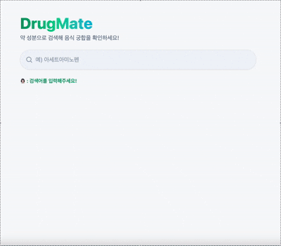

# 📝 Week 03 Assignment - Card Search List UI

## 🚀 Overview

3주차 과제는 카드 검색 리스트 UI 구현과 Album Search List 두 가지 중 하나를 선택하는 방식이었습니다.<br />
저는 **카드 검색 리스트 UI**를 선택했고, 여기에 저만의 아이디어를 혼합하여 과제를 진행했습니다.

## 💡 Idea

우리가 일상생활에서 약을 복용하는 일은 흔하지만, **함께 먹으면 안 되는 음식**들을 매번 직접 검색해야 하는 것은 꽤 번거로운 일입니다.<br />
특히 어떤 음식은 약과 함께 복용했을 때 **치명적인 부작용**을 일으킬 수 있고, 어떤 경우는 **약의 효능을 떨어뜨리거나 흡수를 방해**하기도 합니다.

물론 식단 앱이나 건강 관리 어플에서 관련 정보를 제공하는 경우도 있지만,<br />
저는 **"약과 음식 궁합"에만 집중된 심플한 서비스**가 있으면 더 직관적이고 유용할 것이라고 생각했습니다.

이번 과제에서는 이런 아이디어를 기반으로,<br />
특정 약을 검색하면 함께 먹으면 안 되는 음식과 함께 먹으면 좋은 음식 목록을<br />
카드 UI로 한눈에 확인할 수 있는 기능을 구현하는 것을 목표로 합니다.

## 🎥 Demo

약 성분을 검색하고, 약 복용 시 피해야 할 음식과 권장 음식이 카드 형태로 표시되는 과정과<br />
존재하지 않는 성분을 검색했을 때 에러 메시지가 표시되는 과정을 시연한 GIF입니다.



## ⚒️ Tech Stack

✓ `React`<br />
✓ `JavaScript`<br />
✓ `Bun`<br />
✓ `Tailwind CSS`<br />
✓ `JSON Server`<br />

## 🤓 Implementation Details

✓ SearchBar

- 디바운스를 적용해 입력 시 바로 검색 결과 반영
- 빈 입력 시 에러 메시지 표시

✓ DrugResult

- 로딩, 에러, 성공 상태를 관리하여 UI 분기 처리
- db.json 데이터를 기반으로 약 성분 검색
- 검색 결과에 따라 해당 성분 복용 시 피해야 할 음식 / 권장 음식 카드 목록 렌더링

✓ FoodCard

- 음식명 + 설명을 카드 형태로 출력
- 피해야 할 음식과 권장 음식에 따라 배경 색상과 이모지 변경

## 📊 Data

이번 과제에서는 직접 만든 db.json을 사용했습니다.

```json
{
  "drugs": [
    {
      "id": 1,
      "name": "아토르바스타틴",
      "engName": "Atorvastatin",
      "avoid": [
        {
          "name": "자몽",
          "description": "혈중 농도를 높여 근육 부작용 위험을 증가시킬 수 있으므로 피하셔야 합니다."
        }
      ],
      "good": [
        {
          "name": "저녁 식사 후 복용",
          "description": "밤 시간대에 콜레스테롤 합성이 활발하여 약효가 최적화됩니다."
        }
      ]
    }
  ]
}
```

이 mock 데이터는 연구 자료 및 병원 문헌을 참고하여 작성되었으나,<br />
실제 의료 조언을 대체하지 않는다는 점을 참고하시면 좋겠습니다.

## 📁 Folder Structure

```bash
week03-card-search/
├─ src/
│  ├─ components/
│  │  ├─ DrugResult.jsx  # API 연동 및 결과 출력
│  │  ├─ FoodCard.jsx    # 음식 카드 UI
│  │  └─ SearchBar.jsx   # 검색창 (디바운스 + 에러 처리)
│  ├─ styles/
│  │  └─ input.css       # 검색창 input 스타일 모듈
│  ├─ app.jsx            # 메인 페이지 (상태 관리)
│  ├─ index.css       # Tailwind base + 커스텀 import
│  └─ main.jsx
├─ db.json               # JSON Server mock 데이터
└─ ...
```

## 🛜 How to Run

```bash
# 의존성 설치
bun install

# mock API 실행
npx json-server --watch db.json --port 4000

# 개발 서버 실행
bun dev
```

## 💭 Retrospective

지난 주와 지지난 주에는 타입스크립트 강의를 시청한답시고 리액트 과제를 진행하지 못 했다. 매우 아쉬웠는데 이번주에 진행할 수 있게 되어서 기분 좋게 과제를 진행할 수 있었다.

이 아이디어는 내가 실제로 약을 복용할 때 겪은 불편함에서 출발했다. 어렸을 때 위기탈출 넘버원이라는 프로그램에서 어떤 약은 어떤 음식이랑 먹으면 안 된다는 내용을 본 적이 있다. 그게 인상이 깊었던 건지, 아직도 내 머릿속에 자리 잡아서 해열제나 진통제, 항생제 등을 복용할 때마다 "오늘 섭취한 음식과 이 약이 안 맞으면 어떡하지?", "부작용 생기면 어떡하지" 등의 걱정을 항상 했었다. 그래서 그럴 때마다 네이버에 검색하곤 했는데, 네이버에 검색을 하게 되면 블로그까지 타고 들어가서, (심지어 블로그에 들어갔을 때 정보가 바로 나오는 것도 아니다 🤨) 글의 후반부까지 스크롤을 내려야 "해당 약은 00음식과 복용하면 안돼요!"라는 문구를 발견할 수 있다. . .😶‍🌫️

이런 점에서 불편함을 겪어 메모장에 적어둔 아이디어였는데, 이번 과제를 통해 실제로 구현할 수 있게 되어서 매우 뿌듯하고 재밌는 과정이었다.

요새 내가 초심을 좀 잃고 있는 느낌이 든다. 자꾸 마음이 다른 곳에 집중하게 되고, 공부는 하기 싫고 딴 짓하고 싶어진다. 하지만 그럴 때마다 우리 고양이들을 보면서 마음을 다잡는다. ㅠㅠ 진짜 꼭 프론트엔드 개발자 돼서 단독주택에서 살면서 코딩하고 싶다.. 아니 나는 그렇게 될 거야!!! 이 세상에 불가능한 일은 없거든요~!! 새로 시작하는 한 주, 또 새로 시작하는 한 달, 다시 마음을 다잡고! 다시 달려보는 거야아아악~!!! 💨
